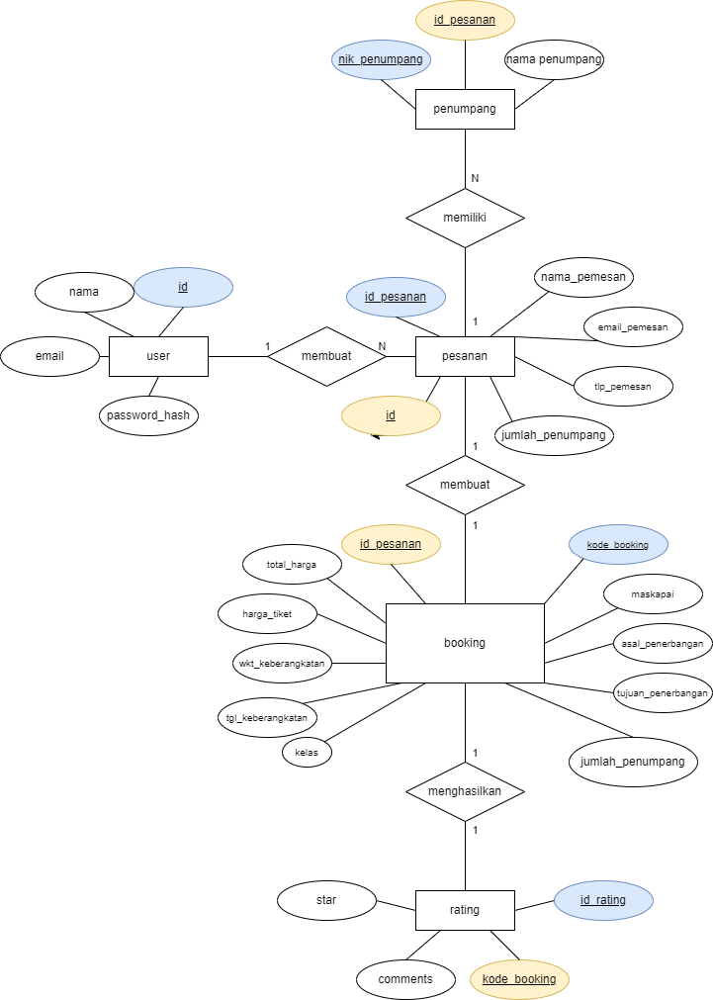

# ✈️ Terbang Berkelas

**Terbang Berkelas** is a web-based application designed for booking and selling plane tickets. This mockup app offers full backend functionality, allowing users to explore a simplified airline ticketing system. Built using fundamental web technologies like **PHP** and **CSS**, it operates with a fully functional **MySQL** database via **XAMPP**.

## 🚀 Features

- **🔒 Login System**: Secure login for users to access the app.
- **🎟️ Ticket Management**: Browse, book, and manage plane tickets.
- **⭐ Ratings Page**: Users can leave ratings for their experiences.
- **📊 Database Integration**: Seamless backend connectivity using MySQL.
- **🖥️ Simple & Elegant Design**: Styled purely with CSS (no JavaScript).
- **🔄 Rescheduling**: Option to reschedule tickets with appropriate feedback.

## 🛠️ Technologies Used

- **Frontend**: HTML + CSS
- **Backend**: PHP
- **Database**: MySQL (via XAMPP)

## 📂 Project Structure

```
terbang-berkelas/
├── css/                       # Stylesheets
│   ├── style-akhirBooking.css
│   ├── style-booking.css
│   ├── style-bookingLanjut.css
│   ├── style-loginregis.css
│   ├── style-main.css
│   ├── style-process.css
│   ├── style-ratingLanjut.css
│   └── style-rescheduleDanRating.css
├── database/                  # Database files
├── ERD/                       # Entity Relationship Diagram
├── images/                    # Images and other static assets
├── akhirBooking.php           # Final booking process page
├── booking.php                # Booking management page
├── bookingLanjut.php          # Extended booking page
├── database.php               # Database connection
├── index.php                  # Main entry point
├── login.php                  # User login page
├── logout.php                 # User logout page
├── process-reschedule.php     # Reschedule processing script
├── process-signup.php         # User signup processing script
├── rating.php                 # Rating page
├── ratingGagal.php            # Failed rating submission page
├── ratingLanjut.php           # Extended rating page
├── rating-success.php         # Successful rating submission page
├── reschedule.php             # Reschedule page
├── rescheduleGagal.php        # Failed reschedule submission page
├── rescheduleLanjut.php       # Extended reschedule page
├── reschedule-success.php     # Successful reschedule page
├── signup.php                 # User signup page
├── signup-success.php         # Successful signup page
└── validate-email.php         # Email validation script
```

## 📊 Database ERD

Below is the Entity Relationship Diagram (ERD) for **Terbang Berkelas**:



### Key Entities

1. **User**: Stores user login information.
2. **Penumpang**: Details of passengers.
3. **Pesanan**: Records orders linked to users and passengers.
4. **Booking**: Handles flight booking details.
5. **Rating**: Captures user feedback and ratings.

## 🛤️ Setup Instructions

Follow these steps to set up **Terbang Berkelas** on your local machine:

1. **Install XAMPP**: Download and install [XAMPP](https://www.apachefriends.org/index.html).

2. **Clone the Repository**:
   ```bash
   git clone https://github.com/your-username/terbang-berkelas.git
   ```

3. **Import the Database**:
   - Open **phpMyAdmin** via `http://localhost/phpmyadmin`.
   - Create a new database named `terbang_berkelas`.
   - Import the SQL file located at `database/terbang_berkelas.sql`.

4. **Run the App**:
   - Place the project folder in the `htdocs` directory of your XAMPP installation.
   - Start **Apache** and **MySQL** services via the XAMPP Control Panel.
   - Access the app at `http://localhost/terbang-berkelas`.

## 🤝 Contributing

Contributions are welcome! If you'd like to improve **Terbang Berkelas**, feel free to fork the repository and submit a pull request.

---

### ✨ Happy Booking! ✈️
5bde0d4 (Initial commit: Add project files entirely)
